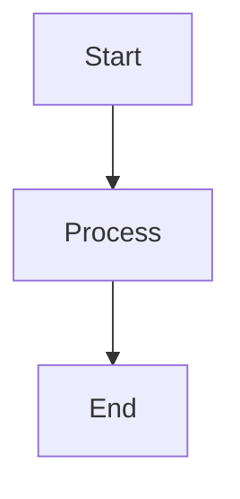

# MetaMark

A modern document markup and collaboration system written in Rust.

## Features

- 📝 Rich document markup with metadata support
- 🔒 End-to-end encryption for secure document storage
- 🤝 Real-time collaboration with conflict resolution
- 📤 Export to multiple formats (PDF, HTML, JSON, DOCX)
- 🔄 Version control with commit tracking
- 🎨 Beautiful syntax highlighting and preview
- 🚀 High-performance parsing and processing

## Installation

### Prerequisites

- Rust 1.70 or later
- Cargo package manager

### Building from Source

```bash
# Clone the repository
git clone https://github.com/SuperScary/metamark.git
cd metamark

# Build the project
cargo build --release

# Install the CLI tool
cargo install --path metamark-cli
```

## Usage

### CLI Commands

```bash
# Create a new document
mmk new "My Document" --output doc.mmk

# List all documents
mmk list

# Show document information
mmk info doc.mmk

# Edit a document
mmk edit doc.mmk

# Export to different formats
mmk export doc.mmk --format pdf --output doc.pdf
```

### Document Format

MetaMark documents use the `.mmk` extension and support:

- YAML/TOML metadata headers
- Markdown-like syntax
- Code blocks with syntax highlighting
- Math equations (KaTeX compatible)
- Diagrams (Mermaid.js compatible)

Example:

```mmk
---
title: My Document
authors: ["John Doe"]
version: 1.0.0
tags: ["documentation", "example"]
---

# Introduction

This is a MetaMark document with **rich** formatting.

```rust
fn hello_world() {
    println!("Hello, MetaMark!");
}
```

## Math Support

\[E = mc^2\]

## Diagrams


```

## Project Structure

```
metamark/
├── core/               # Core library
│   ├── lexer.rs       # Document lexer
│   ├── parser.rs      # AST parser
│   ├── ast.rs         # Abstract Syntax Tree
│   └── security.rs    # Encryption system
├── cli/               # Command-line interface
│   └── main.rs        # CLI implementation
├── server/            # Collaboration server
│   └── mmkd.rs       # Server implementation
└── editor/            # GUI editor
    └── src/           # Editor source code
```

## Contributing

1. Fork the repository
2. Create a feature branch
3. Commit your changes
4. Push to the branch
5. Create a Pull Request

## License

This project is licensed under the MIT License - see the LICENSE file for details.
